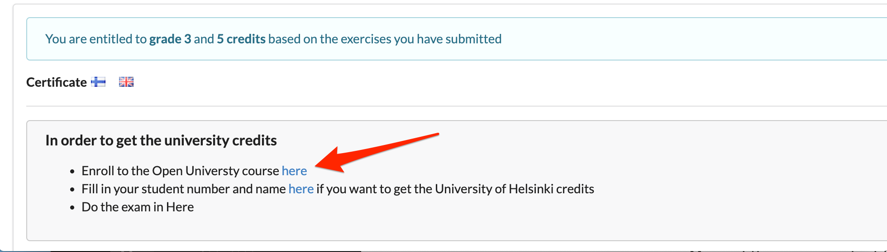
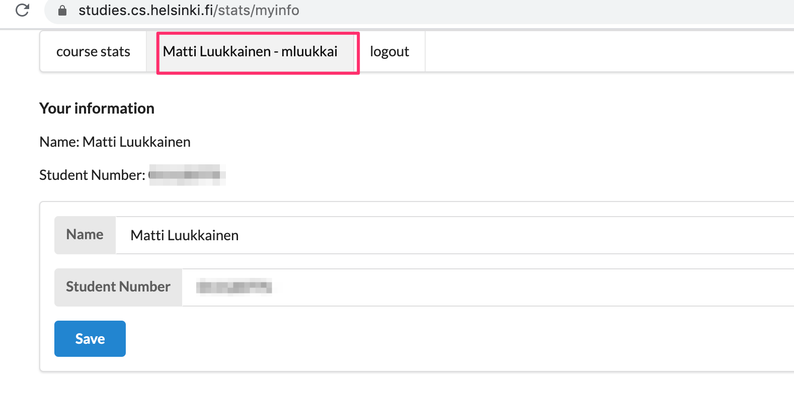
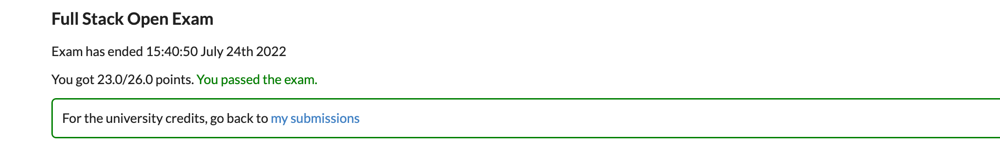
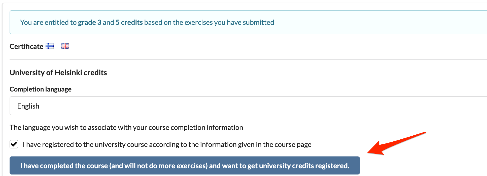

# Full Stack Open: Course Guide

This guide provides a comprehensive overview of the Full Stack Open course, covering curriculum structure, enrollment steps, submission procedures, and university credit requirements.

## 1. Course Overview
Full Stack Open introduces modern web development using JavaScript. The curriculum focuses on single-page applications built with React, supported by Node.js, RESTful APIs, and GraphQL web services.

Key topics covered across the curriculum:
*   Frontend & Backend: React, Node.js, REST APIs, GraphQL.
*   Specialized Tracks: TypeScript, React Native, Continuous Integration (CI/CD).
*   Infrastructure: Debugging, containerization, runtime configuration, and relational databases.

The course is completely free of charge, offering both a certificate of completion and optional University of Helsinki ECTS credits.

## 2. Prerequisites
Participants should possess:
*   Fluency in a programming language (typically requiring 100-200 hours of coding experience).
*   Foundational knowledge of web programming and databases.
*   Working knowledge of Git version control.
*   Strong capacity for self-directed problem-solving and information retrieval.

## 3. Study Structure & Completion
The course adopts a Mastery Learning approach. Content is structured into 14 sequential parts (numbered 0-14). Progressing from part n to part n+1 requires sufficient mastery of the exercises in part n.

------------------------------------------------ total number of submitted exercises:

| Exercises Submitted | Credits | Grade |
| :--- | :---: | :---: |
| 150 | 7 | 5 |
| 135 | 6 | 5 |
| 116 | 5 | 5 |
| 105 | 5 | 4 |
| 94 | 5 | 3 |
| 83 | 5 | 2 |
| 72 | 5 | 1 |

*Note: The course certificate can be acquired upon submitting sufficient passing exercises without taking the exam.*

## 4. Extension Modules (Parts 8-14)
Material and practical guidelines for parts 8 through 14 are hosted on dedicated platforms:

*   Part 8: GraphQL - [https://courses.mooc.fi/org/uh-cs/courses/full-stack-open-graphql](https://courses.mooc.fi/org/uh-cs/courses/full-stack-open-graphql)
*   Part 9: TypeScript - 14 are hosted on dedicated platforms:

*   Part 8: GraphQL - [https://courses.mooc.fi/org/uh-cs/courses/full-stack-open-graphql](https://courses.mooc.fi/org/uh-cs/courses/full-stack-open-graphql)
*   Part 9: TypeScript - [https://courses.mooc.fi/org/uh-cs/courses/full-stack-open-typescript](https://courses.mooc.fi/org/uh-cs/courses/full-stack-open-typescript)
*   Part 10: React Native - [https://courses.mooc.fi/org/uh-cs/courses/full-stack-open-react-native](https://courses.mooc.fi/org/uh-cs/courses/full-stack-open-react-native)
*   Part 11: CI/CD - [https://courses.mooc.fi/org/uh-cs/courses/full-stack-open-continuous-integration](https://courses.mooc.fi/org/uh-cs/courses/full-stack-open-continuous-integration)
*   Part 12: Containers - [https://courses.mooc.fi/org/uh-cs/courses/full-stack-open-containers](https://courses.mooc.fi/org/uh-cs/courses/full-stack-open-containers)
*   Part 13: Relational Databases - [https://courses.mooc.fi/org/uh-cs/courses/full-stack-open-relational-databases](https://courses.mooc.fi/org/uh-cs/courses/full-stack-open-relational-databases)
*   Part 14: Next.js - [https://courses.mooc.fi/org/uh-cs/courses/full-stack-open-nextjs](https://courses.mooc.fi/org/uh-cs/courses/full-stack-open-nextjs)

## 5. Submission & Plagiarism Policies
*   Submissions: Code must be pushed to GitHub and marked complete on the [submission system](https://studies.cs.helsinki.fi/stats/courses/fullstackopen).
*   Submission Scope: Modules are marked one part at a time; no additions are allowed for a part after submitting.
*   Integrity: Submissions are checked using automated plagiarism tools per the University of Helsinki [policy on plagiarism](https://guide.student.helsinki.fi/en/article/what-cheating-and-plagiarism).

## 6. Discord Support Guidelines
Ask specific, debug-ready questions in the dedicated [Discord Community](https://study.cs.helsinki.fi/discord/join/fullstack). Use the format below:

    In exercise 2.15 when I try to add a new person to the app, the server responds with a 403, despite the request looking ok to me.
    
    The code looks like this:
    // the relevant part of code is pasted here with console.log traces
    
    The following gets printed to the console:
    // data printed to console
    
    The network tab looks like the following:
    [screenshot from the network console]
    
    All the code can be found here: (link to GitHub)

## 7. Examination & Academic Credits
To receive official ECTS credits:
1.  Submit passing exercises on the submission portal.
2.  Enroll via the Open University link generated in your submission dashboard:
    
3.  Save your University of Helsinki student ID in your profile:
    
4.  Launch the 120-minute online course exam:
    
5.  Verify exam completion:
    
6.  Request registration by confirming completion:
    
    Confirm your choice by pressing the confirmation button twice:
    

Official transcripts can be ordered using the student services [e-form](https://elomake.helsinki.fi/lomakkeet/132797/lomake.html?rinnakkaislomake=Rinnakkaislomake1_en%5Bk%5D).

## 8. Recommended Environment & Tools
*   Browser: Google Chrome or Firefox Developer Edition.
*   Editor: [Visual Studio Code](https://code.visualstudio.com/).
*   Runtime: [Node.js](https://nodejs.org/en/) (Use v22 for core modules, v20 for Part 10, v18 for remaining sections).
*   Package Management: npm and npx.

## 9. Maintenance & Contribution
The course has no yearly iterations and runs continuously. Content and dependencies are incrementally upgraded.

To report inaccuracies, propose modifications via the link at the base of the page or directly open a pull request on the [course repository](https://github.com/fullstack-hy2020/fullstack-hy2020.github.io).
