# Fundamentals of Web Applications (Part 0b)

This document covers the structural foundations of web applications through an inspection of the legacy architecture used in the example application at https://studies.cs.helsinki.fi/exampleapp.

--------------------------------------------------------------------------------

## 1. Browser Developer Tools & First Principles

The primary requirement for modern web development is keeping the Developer Tools open at all times.

- **Shortcut (macOS):** `fn` + `F12` or `option` + `cmd` + `i`
- **Shortcut (Windows/Linux):** `Fn` + `F12` or `ctrl` + `shift` + `i`
- **Context Access:** Inspect element via the [context menu](https://en.wikipedia.org/wiki/Menu_key).

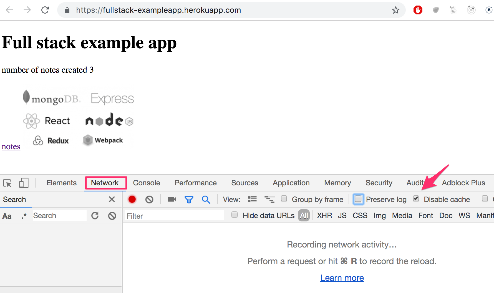

### Key Panels
- **Console:** Primary interface for runtime errors, evaluation, and application logging via `console.log`.
- **Network:** Displays all real-time client-server communication. Enable **Disable cache** and consider **Preserve log** to inspect requests across full page navigations.

--------------------------------------------------------------------------------

## 2. HTTP GET Mechanics

The web client and server communicate using the [HTTP](https://developer.mozilla.org/en-US/docs/Web/HTTP) protocol. Initial navigation initiates an HTTP [GET](https://developer.mozilla.org/en-US/docs/Web/HTTP/Methods/GET) transaction.

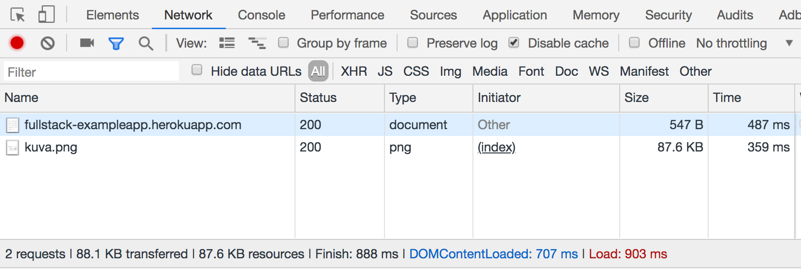

When loading `studies.cs.helsinki.fi/exampleapp`, the browser performs two consecutive requests:
1. Retrieval of the base HTML file (`status 200`).
2. An auxiliary request triggered by an `img` tag to retrieve `kuva.png`.

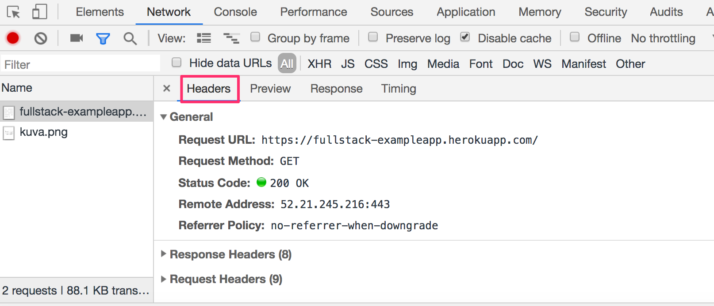

### Critical HTTP Headers
- **[Status code](https://en.wikipedia.org/wiki/List_of_HTTP_status_codes):** Indicates request outcome (e.g., 200 OK, 302 Found, 201 Created).
- **[Content-Type](https://developer.mozilla.org/en-US/docs/Web/HTTP/Headers/Content-Type):** Informs the browser how to parse raw byte data (e.g., `text/html; charset=utf-8`, `image/png`, or `application/json`).

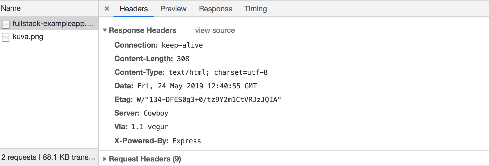

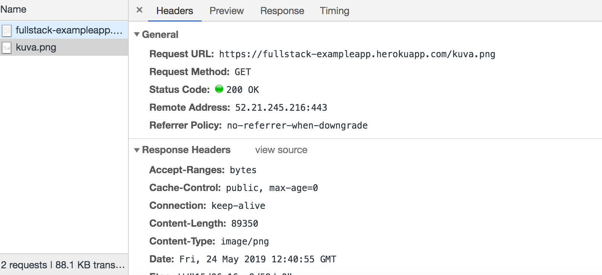
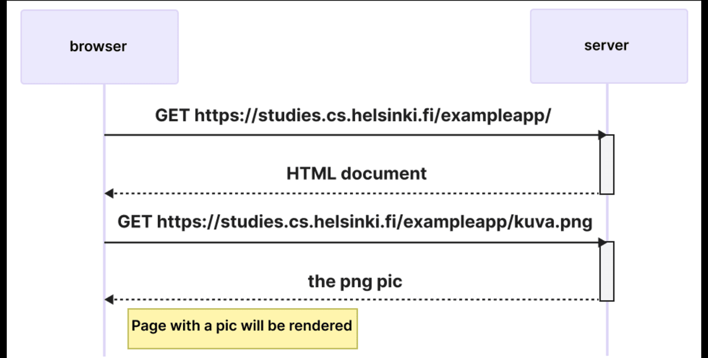

--------------------------------------------------------------------------------

## 3. Web Architecture Models

Web patterns vary based on where application logic resides and how visual updates occur.

| Feature | Traditional Web Application | Early AJAX Architecture | Single-Page Application (SPA) |
| :--- | :--- | :--- | :--- |
| **Logic Location** | Primarily Server-side | Hybrid (Browser renders data) | Primarily Client-side (Browser) |
| **Document Delivery** | Complete HTML generated per request | HTML shell + client data fetch | Single static HTML + dynamic DOM |
| **Data Format** | Rendered HTML markup | Raw JSON via XMLHttpRequest | JSON via fetch / API payload |
| **Form Submissions** | HTTP POST with HTTP 302 redirect | Traditional HTTP POST reload | Asynchronous POST without page reload |
| **Page Re-rendering**| Full browser refresh | Partial updates; form resets page| In-place DOM updates via JavaScript |

### Architecture Flows

    Traditional / Early AJAX Form Submission Flow:
    
    Browser                                           Server
       |                                                 |
       |--- POST /new_note (Form Body: text payload) --->|
       |<-- 302 Redirect (Location: /notes) -------------|
       |                                                 |
       |--- GET /notes (HTML document) ----------------->|
       |<-- 200 OK (HTML text) --------------------------|
       |--- GET /main.css ------------------------------>|
       |--- GET /main.js ------------------------------->|
       |--- GET /data.json ----------------------------->|
       |<-- 200 OK (JSON notes data array) --------------|
       v                                                 v

    Single-Page Application (SPA) Flow:
    
    Browser                                           Server
       |                                                 |
       | [e.preventDefault() intercepts submit]          |
       | [Local DOM update + redraw]                     |
       |                                                 |
       |--- POST /new_note_spa (JSON payload) ---------->|
       |<-- 201 Created (No redirect needed) ------------|
       v                                                 v

--------------------------------------------------------------------------------

## 4. Browser Runtime Logic & The DOM

When executing client-side scripts, browsers evaluate dynamic tree structures.

### Document Object Model (DOM)
The [DOM](https://en.wikipedia.org/wiki/Document_Object_Model) is an API providing programmatic access to modify the page tree.

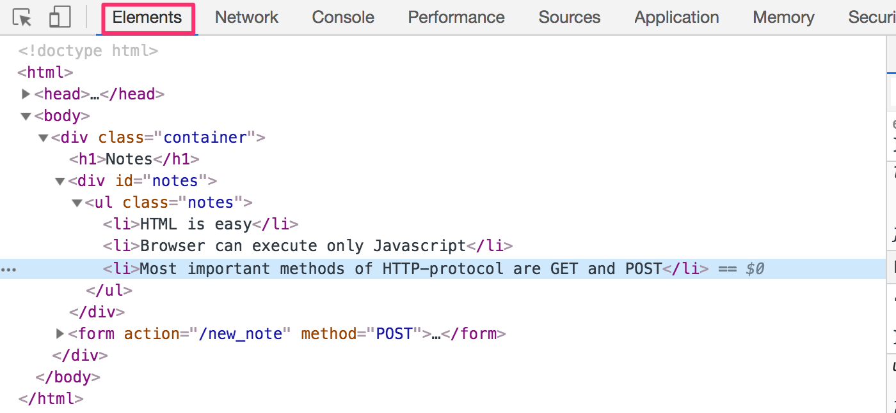

    DOM Tree Hierarchy:
    html
      +-- head
      |     +-- link
      |     +-- script
      +-- body
            +-- div.container
                  +-- h1
                  +-- ul.notes
                  |     +-- li
                  |     +-- li
                  +-- form#notes_form
                        +-- input

### Direct Console Manipulation
The global `document` node can be inspected and updated imperatively inside the browser console:

    list = document.getElementsByTagName('ul')[0]
    newElement = document.createElement('li')
    newElement.textContent = 'Page manipulation from console is easy'
    list.appendChild(newElement)

*Note: Changes executed directly inside browser memory are transient and reset upon document reload.*

--------------------------------------------------------------------------------

## 5. CSS Styling and Inspecting

Cascading Style Sheets define the layout and appearance of DOM nodes through [class selectors](https://developer.mozilla.org/en-US/docs/Web/CSS/Class_selectors) or identifiers.

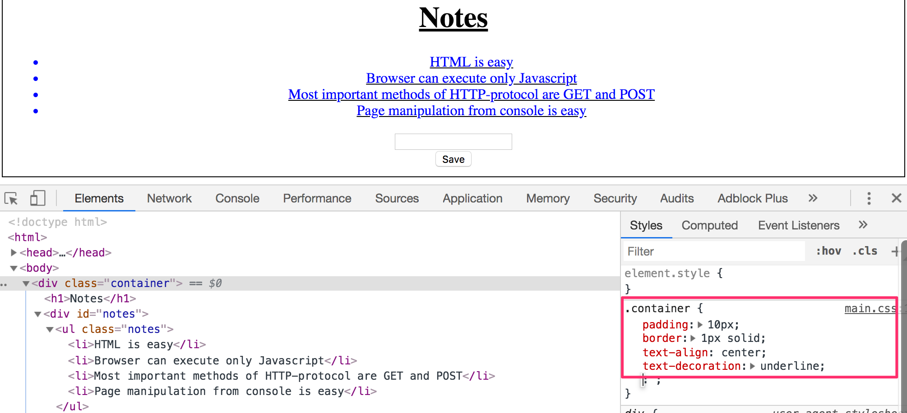

Styles can be tested live inside the Elements tab; however, permanent style definitions require changes to the stylesheet stored on the server (`main.css`).

--------------------------------------------------------------------------------

## 6. Page Execution Cycle: Notes Application

The full network lifecycle of the interactive notes page follows a sequential data pipeline:

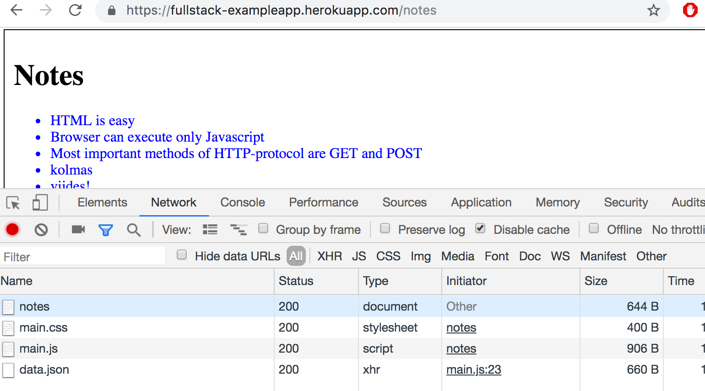
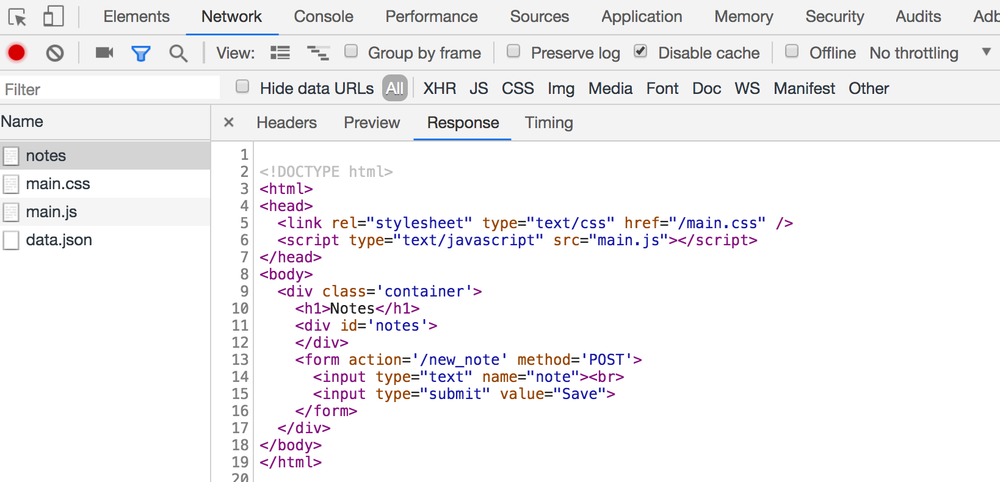
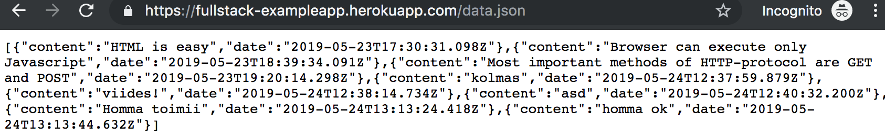
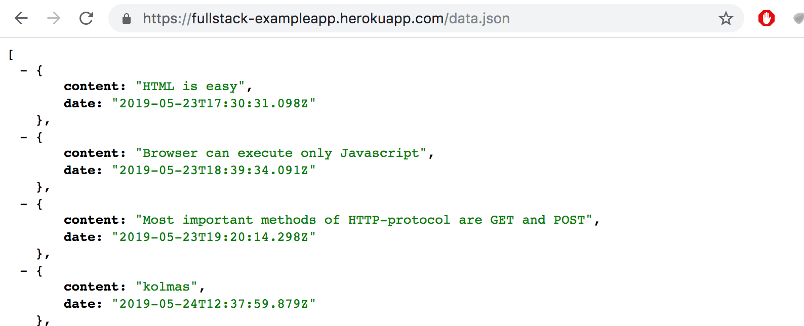
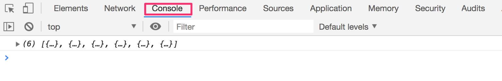

1. The browser requests the main document via HTTP GET.
2. The HTML parser encounters tags for `main.css` and `main.js`.
3. The JavaScript payload executes immediately, instantiating an `XMLHttpRequest`.
4. The client issues a GET request for `/data.json`.
5. An asynchronous **callback function** executes when `readyState == 4` and `status == 200`, iterating through the JSON array and appending `li` elements to the target `ul`.

--------------------------------------------------------------------------------

## 7. Form Handling & State Transition

### Traditional Form Submission
Forms configured with standard HTML attributes send data through multipart or URL-encoded POST requests:

The endpoint handles creation on the server and responds with an HTTP `302 Found` header directing the client to `/notes`, prompting the full chain of 4 asset fetches again.

### Modern SPA Event Interception
Modern applications prevent complete browser reloads by overriding submit events directly:

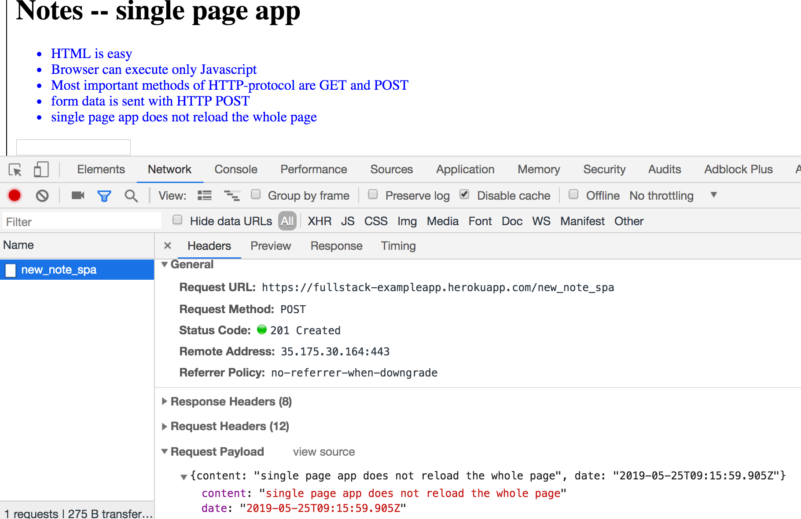

    SPA Form Event Handling Pattern:
    
    var form = document.getElementById('notes_form')
    form.onsubmit = function(e) {
      e.preventDefault()
      var note = {
        content: e.target.elements[0].value,
        date: new Date(),
      }
      notes.push(note)
      e.target.elements[0].value = ''
      redrawNotes()
      sendToServer(note)
    }

The `Content-Type: application/json` header informs the server to parse incoming bytes as structured JSON.

--------------------------------------------------------------------------------

## 8. Industry Landscape & Concepts

### Terminology
- **[AJAX](https://en.wikipedia.org/wiki/Ajax_(programming)):** Asynchronous JavaScript and XML; the historical catalyst for updating page elements without hard reloads.
- **[Vanilla JavaScript](https://www.freecodecamp.org/news/is-vanilla-javascript-worth-learning-absolutely-c2c67140ac34/):** Pure JavaScript development without abstractions or helper libraries.
- **Libraries & Frameworks:** Progression from [jQuery](https://jquery.com/) to early MVC tools ([BackboneJS](http://backbonejs.org/), [AngularJS](https://angularjs.org/)), settling on modern component tools like [React](https://react.dev/) paired with state management like [Zustand](https://github.com/pmndrs/zustand).
- **Full Stack Development:** Management across client-side logic (frontend), web servers (backend via [Node.js](https://nodejs.org/en/)), and datastores.
- **JavaScript Fatigue:** Industry fatigue resulting from high churn and configuration complexity across the JavaScript tool ecosystem.

--------------------------------------------------------------------------------

## 9. Exercises (0.1 - 0.6)

Submission takes place through GitHub, marking tasks complete in the [submission system](https://studies.cs.helsinki.fi/stats/courses/fullstackopen).

Directory structure convention:

    part0
    part1
      courseinfo
      unicafe
      anecdotes
    part2
      courseinfo
      phonebook
      countries

### Task Catalog
- **0.1 HTML:** Complete reading the [HTML tutorial](https://developer.mozilla.org/en-US/docs/Learn/Getting_started_with_the_web/HTML_basics). *(No submission required)*
- **0.2 CSS:** Complete reading the [CSS tutorial](https://developer.mozilla.org/en-US/docs/Learn/Getting_started_with_the_web/CSS_basics). *(No submission required)*
- **0.3 Forms:** Complete reading the [Your first form](https://developer.mozilla.org/en-US/docs/Learn/HTML/Forms/Your_first_HTML_form) guide. *(No submission required)*
- **0.4 New Note Diagram:** Create an interaction diagram detailing the sequence where a user creates a new note in the traditional application version.
- **0.5 Single Page App Diagram:** Create an interaction diagram representing the user visiting the SPA version at https://studies.cs.helsinki.fi/exampleapp/spa.
- **0.6 New Note in SPA Diagram:** Create an interaction diagram representing a note submission in the SPA version.
