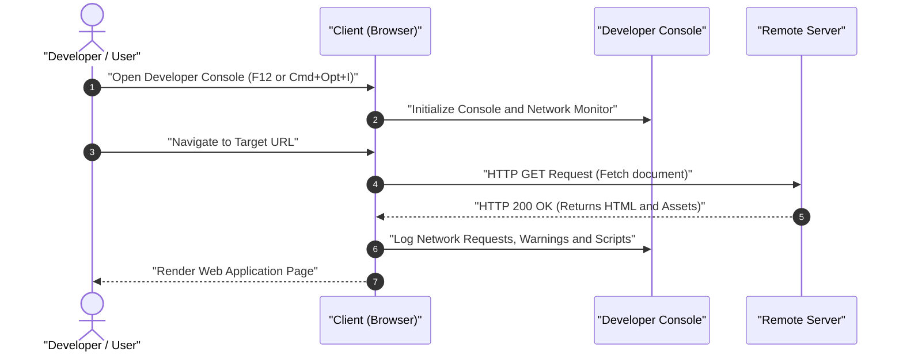

# Full Stack Open: Fundamentals of Web Apps

Welcome to the documentation notes for the introductory portion of the **Full Stack Open** curriculum. This document covers foundational practices, essential developer tooling, and basic client-server request interactions.

---

## Table of Contents
1. [Key Concepts Summary](#key-concepts-summary)
2. [Comparison & Technical Overview](#comparison--technical-overview)
3. [Client-Server Interaction Diagram](#client-server-interaction-diagram)
4. [Developer Workflow & Best Practices](#developer-workflow--best-practices)

---

## Key Concepts Summary

* **Golden Rule of Web Development:** Always keep your browser's Developer Tools open when writing, testing, or debugging web code.
* **Development Environment:** Google Chrome is the recommended standard environment for the course exercises.
* **Educational Scope:** Initial examples highlight foundational and legacy web patterns to build a strong mental model before transitioning to modern Single Page Applications (SPAs) and React ecosystem standards.

---

## Comparison & Technical Overview

| Topic | Standard Practice / Shortcut | Significance |
| :--- | :--- | :--- |
| **Developer Tools (macOS)** | `Option + Cmd + I` or `Fn + F12` | Instant access to console logs, DOM inspection, and network traffic monitoring. |
| **Developer Tools (Windows/Linux)** | `Ctrl + Shift + I` or `F12` | Primary debugging interface across Windows and Linux environments. |
| **Example Application** | `https://studies.cs.helsinki.fi/exampleapp` | Demonstrates basic baseline HTTP request/response loops. |
| **Recommended Browser** | Google Chrome | Ensures uniform rendering engine behavior during learning modules. |

---

## Client-Server Interaction Diagram

The following sequence diagram models the browser initialization process and network activity logging when opening a web application with the Developer Console active.

